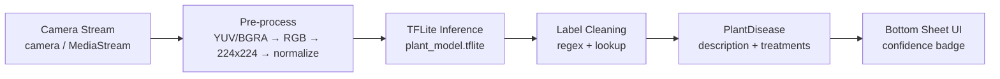

<div align="center">

# GreenEye 🌿
### Real-time Plant Disease Classifier

*Helping farmers and gardeners identify plant pathologies early — offline and on-device.*

[](https://flutter.dev)
[](https://dart.dev)
[](https://pub.dev/packages/flutter_litert)
[](https://app.netlify.com)
[](LICENSE)
[](https://sdgs.un.org/goals/goal15)

[Live Demo](https://greeneye.netlify.app) • [Report Bug](https://github.com/SedikDarragi/GreenEye/issues) • [Request Feature](https://github.com/SedikDarragi/GreenEye/issues)

> **Demo:** Connect your repo to Netlify — `netlify.toml` is already configured. See [Deployment](#-deployment) below. Replace the `Live Demo` URL above once deployed.

</div>

---

## ✨ Features

| | Capability |
|---|---|
| 📷 | **Real-time inference** — live camera stream classified every 300ms |
| 🔌 | **Offline-first** — `plant_model.tflite` runs on-device via `flutter_litert`, no internet needed |
| 💡 | **Actionable insights** — pathogen name, symptoms + step-by-step treatment per disease |
| 📱 | **Cross-platform** — Android, iOS, Web (same codebase, conditional `camera` imports) |
| ⚖️ | **Stable UX** — 15-frame majority vote + confidence hysteresis (80% show / 60% hide) avoids flicker |

## 🧠 How it Works



1. **Capture** — `CameraService` (`camera` on mobile) or `CameraServiceWeb` (`dart:html` + `<video>` + `<canvas>`) streams frames.
2. **Pre-process** — `lib/services/classifier_service.dart` converts YUV420/BGRA → RGB, rotates, bilinear-resizes to model input, normalizes to `[-1, 1]`.
3. **Infer** — `Interpreter.run()` → filtered top-2 outputs (`≥0.45`).
4. **Resolve** — `PlantDisease.getInfo()` cleans label (strip indices, `_` normalize) → maps to `lib/models/plant_disease.dart`.

## 🖥️ Preview

> *Add a screenshot or GIF here for best effect — e.g. `docs/preview.gif`*

| Scanner | Result Sheet |
|---|---|
| *camera preview + 250px scan box* | *draggable sheet: name, confidence, image, treatment steps* |

## 🗂️ Covered Conditions

| Label (`labels.txt`) | Disease Card |
|---|---|
| `Algal Leaf Spot (Jackfruit)` | Algal Leaf Spot — *Cephaleuros virescens* |
| `Anthracnose (Mango)` | Anthracnose — *Colletotrichum gloeosporioides* |
| `Aphids (Cotton)` | Aphids — *Aphis gossypii* |
| `Leaf Scorch (Strawberry)` | Leaf Scorch — *Diplocarpon earlianum* |
| `Black Rot (Cauliflower)` | Black Rot — *Xanthomonas campestris* |
| + `Healthy` / `Unknown` fallbacks | Generic handling via `isUnknown` |

> Model supports more classes than the 5 demo labels — extend `_diseaseData` in `lib/models/plant_disease.dart` and `assets/models/labels.txt` to add more.

## 🛠️ Tech Stack

| Layer | Choice |
|---|---|
| Framework | Flutter 3.24, Dart `>=3.0.0 <4.0.0` |
| Camera | `camera ^0.11.0` (mobile) + `dart:html` MediaStream (web) |
| ML | `flutter_litert ^1.4.0` + `plant_model.tflite` (~2 MB) |
| Permissions | `permission_handler ^11.3.1` |
| Lint | `flutter_lints` strict (`analysis_options.yaml`) |

## 📁 Project Structure

```
GreenEye/
├── lib/
│   ├── main.dart                 # GreenEyeApp entry
│   ├── models/plant_disease.dart # Disease repo + label cleaning
│   ├── screens/scanner_screen.dart # Camera + stability logic + UI
│   └── services/
│       ├── classifier_service.dart   # TFLite pipeline
│       ├── camera_service.dart       # Mobile
│       ├── camera_service_web.dart   # Web (VideoElement/Canvas)
│       └── camera_service_stub.dart  # Conditional-import fallback
├── assets/
│   ├── models/plant_model.tflite
│   ├── models/labels.txt
│   └── images/diseases/          # Reference images per disease
├── web/                          # _redirects + _headers for SPA
├── netlify.toml                  # Netlify build + headers
├── render.yaml                   # Optional Render static-site alternative
└── .github/workflows/            # deploy.yml (Pages) + netlify.yml
```

## 🚀 Getting Started

### Prerequisites
- Flutter SDK `>=3.0.0` (`flutter --version`)
- For mobile: Android Studio / Xcode
- No backend required

### Run locally
```bash
git clone https://github.com/SedikDarragi/GreenEye.git
cd GreenEye

flutter pub get
flutter run                 # select device
flutter run -d chrome       # web preview
flutter build web --release --base-href "/"
```

## 🌐 Deployment

This repo is **frontend-only** — no server to deploy on Render; Netlify hosts the static `build/web`.

### Netlify (recommended)
`netlify.toml` already does everything. Just connect the repo:

1. **Netlify Dashboard** → *Add new site* → *Import from Git* → `SedikDarragi/GreenEye`
2. Build command + publish dir are auto-detected (`flutter build web ...` → `build/web`), SPA redirect `/* → /index.html` included.
3. Deploy → update the Live Demo badge URL at the top of this README.

CLI alternative is wired via `.github/workflows/netlify.yml` — add `NETLIFY_AUTH_TOKEN` + `NETLIFY_SITE_ID` as GitHub Actions secrets to auto-deploy on push to `main` (previews on PRs).

### Render (alternative)
`render.yaml` is included as a static-site alternative (same build). Create a **Blueprint** on Render and point it at the repo, or delete the file if you stay on Netlify.

### GitHub Pages
`.github/workflows/deploy.yml` still works (`peaceiris/actions-gh-pages` → `build/web`). Keep only one primary host to avoid confusion.

## 🔧 Configuration

| File | Purpose |
|---|---|
| `netlify.toml` | Build + `[[redirects]]` + cache headers for `.js/.wasm` |
| `web/_redirects` | Fallback copied to `build/web` for SPA routing |
| `web/_headers` | Security headers |
| `web/manifest.json` | PWA name/theme (`GreenEye`, `#4CAF50`) |

## 🤝 Contributing

PRs welcome! For large changes, open an issue first.

```bash
git checkout -b feat/my-change
flutter analyze
flutter test
```

## 📄 License

MIT — see [LICENSE](LICENSE) if present.

---

<div align="center">

*Built for SDG 15 — Life on Land. Sustainable agriculture through accessible on-device AI.*

</div>
